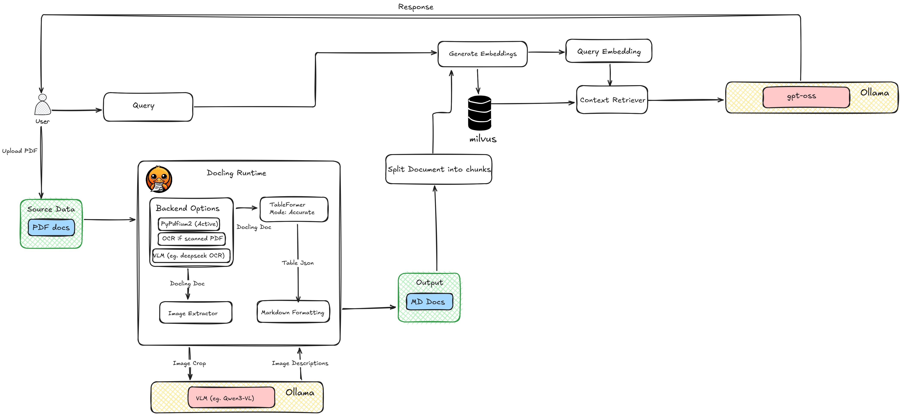

# docling_rag

## Architecture

The system implements a RAG (Retrieval-Augmented Generation) pipeline with the following components:

1. **Document Processing (Docling Runtime)**
   - PDF documents are processed using Docling with multiple backend options (PyPdfium2, OCR, LLM)
   - TableFormer extracts tables in accurate mode
   - Image Extractor handles embedded images (TODO)
   - VLM (e.g., Qwen2-VL) generates image descriptions (TODO)
   - Output is formatted as Markdown

2. **Embedding & Vector Storage**
   - Documents are split into chunks
   - Embeddings are generated and stored in Milvus vector database

3. **Query Processing**
   - User queries are embedded
   - Context Retriever finds relevant chunks from Milvus
   - LLM (e.g., Ollama with gpt-oss) generates responses based on retrieved context